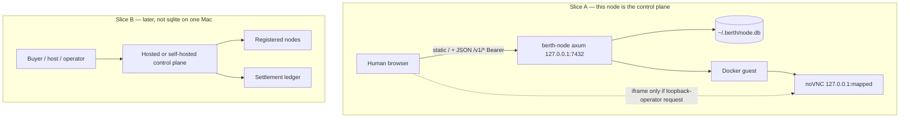
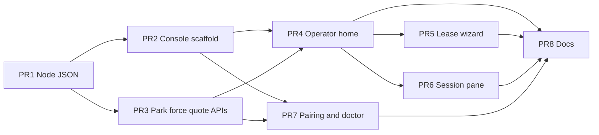

# berth human console (node-local, then control plane)

| Field | Value |
| --- | --- |
| **Title** | Human console + admin: occupancy quotes, live sessions, node health |
| **Author** | berth contributors (placeholder) |
| **Date** | 2026-08-21 |
| **Status** | Slice A shipped (node-local operator console). Not the agent protocol. |
| **Product** | berth ([github.com/codeitlikemiley/berth](https://github.com/codeitlikemiley/berth)) |
| **Scope** | Slice A is the node-local operator console (park, force, wizard). Slice B is a later hosted/self-hosted control plane. Do not collapse them. |

---

## Overview

v0.1 shipped as a CLI+MCP private Linux outpost. Agents live in `berth mcp`. Before Slice A, humans could not: pairing codes went to node stderr, quotes went to stderr, `berth view` printed a loopback noVNC URL, `berth status` knew one lease from `~/.berth/session.toml`, and `berth doctor` was a text report.

This document is the **node console** (operator HTTP): a Vite + React + TypeScript app in `apps/console/`, embedded in `berth-node` and served by the same axum process that already binds `127.0.0.1:7432`. It is **not** the agent protocol (`spec/computer-session.md`: POST/DELETE + WS). Pairing still uses `Authorization: Bearer`, but Slice A **issues additional bearers** (cap 8) so pairing the browser does not revoke CLI/MCP. Default `berth pair` does **not** revoke; `berth pair --revoke-others` / doctor “Revoke other clients” does. Same sqlite ledger. Same `Quote` meter. Humans create leases with a **What → Where (node) → Review** wizard. The operator **parks** (inventory on) and **unparks** (inventory off) this node; they cannot unpark while a lease is live (409). **Force disconnect** forfeits that row’s host income (`incomeUsd = 0`). Nothing is charged in Slice A. The operator of the parked box is both “user” and “admin” because there is one tenant.

It does **not** add a marketplace, wallets, payouts, Stripe, or a hosted SaaS. Those need a control plane that does not exist. The thesis already named the product shape: “one image, one tunnel, one dashboard, no SSH folklore” (`docs/THESIS.md`). Slice A is that dashboard. Slice B is post-MVP items 6–8 in `docs/MVP.md`.

---

## Background & Motivation

### What berth is

Open computer-session layer: protocol + private node + later mesh. Not another agent, not Cua, not Devin (`docs/THESIS.md`). Guest is isolated Linux in Docker. Host desktop is never driven. `class=private` only in v0.1.

### What humans did before Slice A

| Need | Pre-Slice A path |
| --- | --- |
| Pair | Copy `pairing code: ABCD-EFGH` from `berth node up` stderr (`crates/berth-node/src/http.rs` `serve()`). Laptop ran `berth pair --url … --code`. Token landed in `~/.berth/config.toml` (mode 0600). `Db::issue_bearer` **revoked every previous bearer** (`db.rs`); a second pair logged out the first client. |
| See sessions | `berth status` → `GET /v1/leases/{id}` for the **one** id in `session.toml`. No list. |
| See cost | `print_quote` / CLI `format_quote`: `$X USD for Ns min (not charged)` on stderr/stdout. sqlite stores `quote_json`, `billable_seconds`, `elapsed_seconds`. Nothing is charged. |
| Watch the guest | `berth view` prints `http://127.0.0.1:{mapped}/vnc.html`. Tunnel does **not** publish noVNC (`README.md`). |
| Health | `berth doctor` in `crates/berth-cli/src/doctor.rs`: docker, image, `BERTH_HOME`, paired **CLI** nodes, cloudflared, “host desktop is never driven”. Text, not JSON. |
| End / create | `berth end` / `berth up` / MCP `berth_lease` / `berth_end`. |

### HTTP surface before Slice A

`crates/berth-node/src/http.rs` `router()`:

```
Unauthed:  GET  /healthz
           POST /v1/pair
Authed:    POST /v1/leases
           GET  /v1/leases/{id}
           DELETE /v1/leases/{id}
           GET  /v1/sessions/{id}    (WebSocket ActionBatch)
```

`GET /healthz` returns `{"ok": true}` only. Default bind `127.0.0.1:7432` (`crates/berth-cli/src/lib.rs` `NodeCmd::Up`). Auth is `Authorization: Bearer` after `POST /v1/pair` `{code}` → `{token}` (`brt_` + 64 hex). Pairing code is `XXXX-XXXX` from `random_pairing_code()` in `crates/berth-node/src/id.rs`, stored in `~/.berth/pair.code` (hash in sqlite `pair_tokens`). Token is never placed on a URL (`normalize_url` rejects `?` / `#`; advertised `ws_url` is tested to contain neither `?` nor `token`).

`PairRequest` was `{ code: String }` only (`http.rs`). `issue_bearer` always ran `UPDATE pair_tokens SET revoked_at` for `kind = 'bearer'`. Tests locked this (`pair_issues_bearer_and_rotates`). Slice A changed that default (K4). Today: `{ code, revoke_others?: bool }` with `revoke_others` default **false**; test `pair_issues_bearer_and_keeps_previous`.

### sqlite before Slice A

`crates/berth-node/src/db.rs` `SCHEMA`: `pair_tokens`, `workspaces`, `leases`, `sessions`.

No `users`, `nodes`, `ledger_entries`, `hosts`, `invoices`, `payouts`.

`leases` already has the occupancy ledger: `quote_json`, `started_at`, `stopped_at`, `min_seconds`, `elapsed_seconds`, `billable_seconds`. `Db::active_leases()` exists for drain; there is **no** `list_leases`. `LeaseView` omits `started_at` / `stopped_at` / `workspace_id`. `create_lease` builds `LeaseView { … }` **inline** and does not go through `from_row` (`http.rs`).

Drain runs only on shutdown, **not** on startup. A crash can leave `status = 'active'` rows with no in-process guest (`live` map empty).

### Quote (unchanged)

`Quote::from_request` in `crates/berth-protocol/src/quote.rs` (MATH.md seeds, **no protocol cut** — cut is mesh settlement):

```
usd_per_second = (P_CPU * vcpu + P_MEM * mem_gib + P_DISK * disk_gib)
               * density_mult * os_mult
gas_per_second = usd_per_second / USD_PER_GAS    # 0.01
```

Worked 2/4/40 isolated Linux (`crates/berth-protocol/tests/serde.rs` `quote_seed_prices_from_math_md`): **$0.0000134/s → $0.04824/hr**. Shared × 0.30 → **$0.014472/hr**. Container floor is `CONTAINER_MIN_SECONDS = 60` in `http.rs`, even for `density=isolated` (MATH.md’s 300s is the VM floor; this guest is a container). `db::billable_seconds(min, elapsed) = elapsed.max(min)`. On stop, that value is written; until then `billable_seconds` is `NULL`.

### Why a UI now, and why not a control plane

Thesis slide 1 is the Mac mini in the closet. Operators will not SSH to scrape stderr. A node-local dashboard is the Helium-miner shape. A Vercel app with accounts would be a hosted control plane, which `docs/MVP.md` forbids until the private loop is used by humans. sqlite on one Mac is not a marketplace.

---

## Goals & Non-Goals

### Goals (Slice A)

- Serve a human console from the **same** `berth-node` process, loopback bind unchanged, SPA at `/`.
- Pair in the browser without putting the code or bearer in the URL, Vite env, or screenshot URLs, and **without logging out CLI/MCP**.
- List leases from sqlite: status, quote, occupancy USD labeled **quoted, not charged**, clock ticking **only while `live`**. Income badge: **$0 / no income** when the row was force-disconnected.
- Create a lease with a **multi-step wizard** (What → Where/node → Review → `POST /v1/leases`). Linux-only in v0.1. Review shows `Quote` before confirm.
- End a session gracefully (`DELETE /v1/leases/{id}` — occupancy eligible). **Force disconnect** (`POST /v1/leases/{id}/force`) stops the guest and **forfeits host income** for that row.
- **Park / unpark** this node (inventory on/off). Unpark is locked while a lease is live. `POST /v1/leases` is **409** if unparked.
- Session pane: iframe node-local noVNC **only when the browser itself is on the node host**; CSP `frame-src` matches that gate. Otherwise last screenshot if the agent already captured one, else “use MCP / open viewer on the parked box”.
- Doctor/health JSON: Docker, image, allowlist, tunnel child (plumbed), bind, origin hostname, **`parked`**. **No pairing secrets in HTML.**
- Light/dark via concrete design tokens. Reusable components in `apps/console`.
- One API-client seam so Slice B can reuse the package (wizard “Where” lists many nodes later).

### Non-Goals (Slice A)

- Calling occupancy quotes “earnings”, “revenue”, “payout”, or “wallet”.
- Charging, Stripe, credits settlement, protocol cut, cash-out.
- Users, roles, OIDC, session cookies as the v0.1 auth system.
- Multi-node registry, drain-as-fleet, W365 creds, Mac §3 flags.
- Policy enforcement for `recording` / `human_confirm` (fields exist on `LeaseRequest`, unused by the node).
- Publishing noVNC through the tunnel.
- Binding `0.0.0.0` “so the UI works”.
- Driving the host desktop; Electron/Tauri wrapping Finder.
- Rewriting the node in TypeScript.
- A second design system or a Next.js/Vercel app.
- Inventing sqlite tables `users`, `nodes` (fleet registry), `ledger_entries`, `hosts`, invoices, wallets. **Allowed:** one-row `node_state` and additive lease columns `end_reason` / `forfeited` (K16, K17). Occupancy USD is still not stored.
- A second occupancy meter. `incomeUsd` is `quotedUsd` or `0` (forfeit), not a new formula.
- Serving the SPA at `/console` (K3: `/` is decided).
- Treating crash/stale leftovers as a force-forfeit (K6 stays stale, not `forced`).
- Agents (`berth_end`) forfeiting host income.

### Slice B (after humans use the private loop)

Hosted or self-hosted control plane: accounts (buyer / host / operator), occupancy invoices, host payouts minus protocol cut (MATH.md **12%**), spend-or-cash-out, fleet register/drain/images/allowlists, W365 provider, Mac §3, policy. This is `docs/MVP.md` post-MVP **6–8**. Stub **types** in `apps/console/src/api/control-plane.ts` only; pages must not import them. No fake balances in Slice A UI.

---

## Key Decisions

| # | Decision | Rationale |
| --- | --- | --- |
| K1 | **Two slices. Node is the control plane for A.** | Matches `docs/MVP.md` decision 2 and the current process. A SaaS console for one sqlite file is a lie. |
| K2 | **Vite + React + TS in `apps/console/`. React Router. shadcn/ui + Tailwind CSS v4. Recharts behind `MeterChart` only (bar).** | No frontend exists. Concrete tokens in `tokens.css` (below). One chart library, one chart type. |
| K3 | **Embed production `dist/` in `berth-node`; serve the SPA at `/`. `/healthz` and `/v1/*` stay API.** Node 22 is required at **compile** time for a real dashboard. | Helium-miner “open the box.” `/console` is not a fork. `cargo install --path crates/berth-cli` embeds whatever `build.rs` produced; CI/release always run Node. Placeholder is a **dev** hatch when `npm` is missing, not a release story. |
| K4 | **Multiple bearers, cap 8. `POST /v1/pair` `{code, revoke_others?}` defaults `revoke_others: false`.** Console never sends `true` except an explicit “Revoke other clients” control. CLI: `berth pair --revoke-others` for the old rotate-all. Token in **`sessionStorage` only**; “remember this browser” writes `localStorage` **only when `window.location` is loopback**. Never query / hash / Vite env. | Today `issue_bearer` revokes all (`db.rs`); console pair would kill `berth mcp`. Cap prevents pile-up. `EventSource` cannot send `Authorization` — do not “fix” that with `?token=`. trycloudflare `localStorage` is a shared-computer leak. |
| K5 | **Pairing code and loopback CSP only when the request is a loopback-operator request:** `Host` (strip port, accept `[::1]`) is loopback **and** none of `Cf-Ray` / `CF-Connecting-IP` / `CDN-Loop` are present. Ignore `X-Forwarded-*`. If `origin` is set and `Host` equals that origin’s hostname → 404. Document Cloudflare `httpHostHeader: 127.0.0.1` as **unsupported**. | Peer IP is 127.0.0.1 for tunneled traffic. Default quick tunnel forwards `Host: *.trycloudflare.com`. Named tunnels can rewrite Host to localhost; CF headers still mark the edge. |
| K6 | **Ledger read model = `Quote` × seconds. Clock occupancy only while `live === true`.** Stopped → stored `billable_seconds` (fallback `min_seconds`). `status === "active" && !live` → freeze (`elapsed_seconds` else `min_seconds`), badge **stale / not running**. Label every USD figure **quoted, not charged**. | Crash leftovers stay `active` in sqlite (`drain` is shutdown-only). Ticking those rows is fake occupancy. No 12% cut. |
| K7 | **Do not iframe `viewer_url` unless the browser hostname is loopback. CSP `frame-src` is Host-gated the same way as K5, as a per-request `Content-Security-Policy` header — never a `<meta>` tag in `index.html`.** | `viewer_url` is always `http://127.0.0.1:{port}/vnc.html`. A tunneled browser’s `127.0.0.1` is the **laptop**. A baked-in meta CSP cannot vary by Host and would re-allow the wrong-machine iframe. |
| K8 | **Last frame is a cache, not a second driver.** Preview: **204** if live and no screenshot yet; **404** if unknown or not live. `Cache-Control: private, no-store`. Stub guest persists last PNG. | Stopped/drained guests leave `live`. Do not exec `action.sh screenshot`. Do not put Bearer on `img src`. |
| K9 | **Poll leases + node status in Slice A (2s). No SSE in these PRs.** | `EventSource` + query token is forbidden (K4). `fetch` SSE can wait. |
| K10 | **`config.toml` allowlist is CLI/MCP, not node.** | `berth-node` never reads `config.toml`. Doctor shows **node** effective list. Wizard create-lease **omits** `network` (same as CLI when the key is unset). |
| K11 | **Superseded by K15.** Do not ship a one-button “Lease Linux desktop.” | User decision 2026-08-21. |
| K12 | **`mode: node \| control-plane` at the API client only.** Pages must not import `api/control-plane.ts` (eslint `no-restricted-imports`). Slice B adapter throws. No wallet widgets in node mode. | One design system. Wizard Where-step is the fleet seam later. |
| K13 | **Native/SwiftUI is a future HTTP/WS client, not these PRs.** | Do not wrap the host desktop. |
| K14 | **On `berth node up`, print `console: http://<actual>/` when the SPA fallback is registered (PR2).** | No new CLI command. URL has no code and no token. |
| K15 | **Create-lease UI is a three-step wizard: What → Where (connect/select node) → Review.** Confirm calls `POST /v1/leases`. Slice A: one local node, must be **parked**. v0.1 What-step: `os=linux` only (windows/macos disabled with existing MVP copy), `class=private`, `density` default `isolated` (shared allowed; exclusive rejected), resources default 2/4/40 **editable** with node caps (`vcpu`/`mem_gib` > 0). Do **not** draw `recording` / `human_confirm`. Review shows `Quote` from `POST /v1/quote` (**quoted, not charged**), min seconds, allowlist source. | Humans attach a node, not a hidden default. Slice B reuses Where for a fleet. |
| K16 | **Park = this node accepts new leases. Unpark = it does not.** Operator (pairing bearer) only. Default **parked** so CLI/MCP work without the console. Cannot **unpark while any lease is live** (409 + `live_lease_id`). Park always allowed. `POST /v1/leases` while unparked → **409** `{error:"node is unparked"}` **before** `Guest::start`. Persist in one-row `node_state`. `GET /v1/node` includes `parked`. | Inventory, not the guest lease. 409 (not 503) — unparked is deliberate, not an outage (`ShuttingDown` stays 503). |
| K17 | **Graceful end keeps occupancy income-eligible. Force disconnect forfeits that row’s host income ($0).** `DELETE /v1/leases/{id}` and CLI/MCP `berth end` / `berth_end` = graceful (`end_reason=graceful`, `forfeited=0`). `POST /v1/leases/{id}/force` and `berth end --force` = forced (`end_reason=forced`, `forfeited=1`), same stop path, still records `billable_seconds` for occupancy honesty. `incomeUsd = 0` if forfeited else `quotedUsd`. Copy: **No income — forced disconnect.** Not a cash fine. Crash/stale rows are **not** forfeited (K6). | Operator yank is a forfeit of host credit so Slice B settlement can honor it. Agents must not forfeit the host. |

---

## Proposed Design

### Slice split



### Slice A process shape

```
Laptop or parked box browser
        │  HTTP same origin (or Vite proxy in dev)
        ▼
berth-node  127.0.0.1:7432
        ├─ GET  /                 SPA (rust-embed dist)
        ├─ GET  /healthz          {"ok": true}     unauthed
        ├─ POST /v1/pair          {code, revoke_others?} → {token}  unauthed
        ├─ GET  /v1/pairing       {code}           unauthed, loopback-operator only
        ├─ GET  /v1/leases        {leases, truncated}  Bearer
        ├─ POST /v1/leases        create           Bearer (409 if unparked; from_row)
        ├─ GET  /v1/leases/{id}   one              Bearer
        ├─ DELETE /v1/leases/{id} graceful end     Bearer
        ├─ POST /v1/leases/{id}/force  force end   Bearer (forfeit income)
        ├─ POST /v1/quote         Quote, no guest  Bearer
        ├─ GET  /v1/node          doctor JSON      Bearer (includes parked)
        ├─ POST /v1/node/park     inventory on     Bearer
        ├─ POST /v1/node/unpark   inventory off    Bearer (409 if live)
        ├─ GET  /v1/sessions/{id} ActionBatch WS   Bearer (existing, agents)
        └─ GET  /v1/sessions/{id}/preview  PNG/204/404  Bearer
        │
        ▼
Linux guest (Xvfb + openbox + Chromium)   ← not Finder
        └─ noVNC published 127.0.0.1 only (`docker.rs` HostConfig.port_bindings)
```

Optional Cloudflare Tunnel still fronts **node HTTP/WS only**. Console JS loaded via `https://…trycloudflare.com/` can call `/v1/*` with **its own** bearer (K4). It cannot reach guest noVNC. Pairing-code and `frame-src` loopback origins refuse that request (K5).

### Loopback-operator request (shared gate)

One helper used by `GET /v1/pairing` **and** HTML CSP:

```
loopback_operator(headers, origin) iff
  host_is_loopback(Host)                    // strip port; 127.0.0.1 | localhost | ::1 | [::1]
  AND no header named Cf-Ray, CF-Connecting-IP, or CDN-Loop  // ASCII case-insensitive
  AND Host is not the tunnel origin hostname when origin is Some
```

Do **not** consult `X-Forwarded-Host` / `X-Forwarded-For` / `X-Real-IP`. Do **not** use the socket peer (cloudflared dials loopback).

`httpHostHeader: 127.0.0.1` (Cloudflare origin parameter) is **unsupported**: Host looks local, but `Cf-Ray` is present → 404 for the code and `frame-src 'none'`. Document in README / doctor copy.

Tests (table-driven):

| Host | Extra headers | origin | GET /v1/pairing | CSP frame-src |
| --- | --- | --- | --- | --- |
| `127.0.0.1:7432` | none | None | 200 `{code}` | loopback |
| `localhost:7432` | none | None | 200 | loopback |
| `[::1]:7432` | none | None | 200 | loopback |
| `127.0.0.1:7432` | `Cf-Ray: 1` | None | 404 | `'none'` |
| `127.0.0.1:7432` | `CF-Connecting-IP: 1.2.3.4` | None | 404 | `'none'` |
| `127.0.0.1:7432` | `CDN-Loop: cloudflare` | None | 404 | `'none'` |
| `random-words-here.trycloudflare.com` | none | that URL | 404 | `'none'` |
| `127.0.0.1:7432` | none | Some(trycloudflare) | 200 | loopback (operator on the box while tunnel is up) |
| `random-words-here.trycloudflare.com` | none | None | 404 | `'none'` |

Peer is 127.0.0.1 in all of these (matches live cloudflared).

### Console API client (seam 1)

`apps/console/src/api/types.ts` + `apps/console/src/api/node.ts`. Slice B later: `apps/console/src/api/control-plane.ts`.

```ts
export type ConsoleMode = "node" | "control-plane";

export interface WizardLease {
  os: "linux";
  density: "isolated" | "shared";
  resources: { vcpu: number; mem_gib: number; disk_gib: number };
}

export interface BerthApi {
  pair(code: string, opts?: { revokeOthers?: boolean }): Promise<{ token: string }>;
  pairingCode(): Promise<{ code: string } | null>; // null on 404
  listLeases(): Promise<{ leases: LeaseView[]; truncated: boolean }>;
  getLease(id: string): Promise<LeaseView>;
  endLease(id: string): Promise<LeaseView>; // DELETE — graceful
  forceEnd(id: string): Promise<LeaseView>; // POST /v1/leases/{id}/force
  quote(req: WizardLease): Promise<Quote>; // POST /v1/quote
  createLease(req: WizardLease): Promise<LeaseView>; // POST /v1/leases; omit network
  health(): Promise<{ ok: boolean }>;
  node(): Promise<NodeStatus>; // includes parked
  park(): Promise<NodeStatus>;
  unpark(): Promise<NodeStatus>; // 409 if live
  preview(sessionId: string): Promise<Blob | null>; // null on 204; throw on 404
}

export function createApi(mode: ConsoleMode, opts: {
  base: string;
  getToken: () => string | null;
  setToken: (t: string | null) => void;
}): BerthApi;

// apps/console/src/main.tsx (Slice A)
const api = createApi("node", { base: "", getToken, setToken });
```

`createApi("control-plane", …)` throws `Error("control-plane adapter is not implemented")`. Do not use `VITE_BERTH_TOKEN`. `VITE_CONSOLE_MODE` is unnecessary if `main.tsx` hardcodes `"node"`.

`createLease` / `quote` body (K10, K15). Always send `class=private`, `license=linux`, `term=on_demand`; **omit `network`**. Comment in `node.ts`: `// class/license/term match crates/berth-cli mvp_lease_request; resources/density from the wizard`.

```json
{
  "os": "linux",
  "class": "private",
  "license": "linux",
  "density": "isolated",
  "term": "on_demand",
  "resources": { "vcpu": 2, "mem_gib": 4, "disk_gib": 40 }
}
```

Slice A has no `node_id` on the POST (implicit this process). Wizard “Where” is `GET /v1/node` as one card `{ id: "local", parked, bind, image }`.

Headers: `Authorization: Bearer <token>` on authed calls. `POST /v1/pair` has no bearer.

Token persistence (`lib/auth.ts`):

1. Always write the live token to `sessionStorage` key `berth.bearer`.
2. If the user checks “Remember this browser” **and** `url_is_loopback(window.location.origin)`, also write `localStorage`.
3. On trycloudflare / any non-loopback origin: never read or write `localStorage` for the bearer.
4. Boot: `sessionStorage` first; else `localStorage` only if origin is loopback.
5. 401 → clear both (this origin) and route to `/pair`.

### Auth flow

```mermaid
sequenceDiagram
  participant CLI as berth CLI / MCP
  participant Op as Operator browser
  participant Node as berth-node
  Note over CLI,Node: existing laptop pair still valid
  Op->>Node: GET / (SPA, no secrets)
  alt loopback_operator
    Op->>Node: GET /v1/pairing
    Node-->>Op: {"code":"ABCD-EFGH"}
  else tunnel Host or CF headers
    Node-->>Op: 404
    Note over Op: type code from node stderr / local console
  end
  Op->>Node: POST /v1/pair {"code":"ABCD-EFGH"}
  Note over Node: revoke_others defaults false; new row in pair_tokens
  Node-->>Op: {"token":"brt_…"}
  Note over Op: sessionStorage; localStorage only if loopback remember
  Op->>Node: GET /v1/leases  Authorization: Bearer
  Node-->>Op: {"leases":[…],"truncated":false}
  Note over CLI: config.toml bearer still valid
```

#### Multi-bearer (`pair_tokens`, no new table)

`MAX_BEARERS: u32 = 8`.

```rust
// PairRequest — additive; old clients that send only {code} keep working
struct PairRequest {
    code: String,
    #[serde(default)] // false
    revoke_others: bool,
}

fn issue_bearer(&self, revoke_others: bool) -> Result<String> {
    // if revoke_others: UPDATE pair_tokens SET revoked_at WHERE kind='bearer' AND revoked_at IS NULL
    // else if COUNT(*) active bearers >= 8: Error::TooManyBearers (HTTP 409)
    // INSERT new bearer hash (secret stays '')
}
```

- Console pair: `{code}` only.
- Console “Revoke other clients” (`/doctor`): `{code, revoke_others: true}` then store the new token (this browser stays in; CLI/MCP must `berth pair` again).
- CLI: `berth pair --url --code [--revoke-others]`. Default **false**. `NodeClient::pair` sends `{"code", "revoke_others": bool}`.
- Shipped test `pair_issues_bearer_and_keeps_previous`: default keeps t1 valid after t2; `revoke_others: true` invalidates t1; ninth pair without revoke → 409.

`GET /v1/node` includes `active_bearers: u32` (count, not hashes). Do not list tokens.

### Ledger read model (seam 2)

`apps/console/src/lib/ledger.ts`:

```ts
/** Matches Quote::usd_per_second in crates/berth-protocol/src/quote.rs */
export function usdPerSecond(q: Quote): number {
  return Number(q.gas_per_second) * Number(q.usd_per_gas);
}

/**
 * Occupancy USD. Clock only while live.
 * stopped → billable_seconds ?? min
 * active && !live (crash leftover) → elapsed_seconds ?? min  (frozen)
 * live → max(min, now - started_at)   // same floor as db::billable_seconds
 */
export function quotedUsd(lease: LeaseView, nowUnix = Date.now() / 1000): number {
  const min = lease.quote.min_seconds;
  const rate = usdPerSecond(lease.quote);
  if (lease.status === "stopped") {
    return rate * (lease.billable_seconds ?? min);
  }
  if (!lease.live) {
    return rate * (lease.elapsed_seconds ?? min);
  }
  const elapsed = Math.max(0, nowUnix - lease.started_at);
  return rate * Math.max(min, elapsed);
}

export function occupancyBadge(lease: LeaseView): "live" | "stopped" | "stale" {
  if (lease.status === "stopped") return "stopped";
  if (!lease.live) return "stale";
  return "live";
}

/** Host credit for this row. Forfeit on force disconnect. Not a second meter. */
export function incomeUsd(lease: LeaseView, nowUnix = Date.now() / 1000): number {
  if (lease.forfeited || lease.end_reason === "forced") return 0;
  return quotedUsd(lease, nowUnix);
}
```

UI copy: **Quoted occupancy (not charged)**. Badge **stale / not running** for `stale`. Forfeited: **No income — forced disconnect** (do not say “fine”, “penalty paid”, “earnings”). Never “wallet” / “payout”.

Vitest: 2/4/40 isolated `billable_seconds=60` stopped graceful → occupancy **$0.000804** and income **$0.000804**; same row `forfeited: true` → occupancy still **$0.000804**, income **$0**; live 3600s → occupancy **$0.04824**; `active && live === false` does **not** increase when `nowUnix` advances; stale is **not** treated as forfeited.

`MeterChart` (**bar only**, Recharts, this one component): one bar per lease of **current** `quotedUsd` (live-aware). Category = `lease_id`. Fill `var(--chart-1)`, axis/tick `var(--text-muted)`, grid `var(--border)`. Sum footer = Σ quoted USD of the **returned** list, labeled “Quoted occupancy (not charged).” Beside it: Σ `incomeUsd` labeled “Income (forfeited → $0)” — still **not charged**. If `truncated`, footer notes “latest 500 leases.” **No time axis.** Do not persist USD samples.

Startup reconcile of orphan `active` rows (stop leftover guests) is **optional after PR3**, and must **not** set `end_reason=forced` — crash leftovers stay stale (K6, K17).

### Node JSON: list + doctor + pairing + preview

#### `GET /v1/leases` (authed)

`Db::list_leases()` — same `LEASE_SELECT` as `get_lease` plus `stopped_at` / `workspace_id`, `ORDER BY leases.started_at DESC`, handler keeps the first **500**. Response:

```json
{ "leases": [ /* LeaseView */ ], "truncated": false }
```

`truncated: true` iff more than 500 rows existed.

Extend `LeaseView` **additively** on **every** JSON body that returns a lease: GET-one, **POST 201**, DELETE, and list items.

| Field | Source | Why |
| --- | --- | --- |
| existing `lease_id`, `session_id`, `ws_url`, `viewer_url`, `quote`, `status`, `billable_seconds`, `elapsed_seconds` | `LeaseView` today | unchanged |
| `started_at` | `leases.started_at` | live occupancy |
| `stopped_at` | `leases.stopped_at` | stopped timestamp |
| `workspace_id` | `leases.workspace_id` (add to `LeaseRow`) | human table |
| `live` | GET/DELETE/list/force: `contains(session_id)`. POST create: **explicit `true` after `live.insert`** | clock occupancy; stale badge |
| `end_reason` | `leases.end_reason`: `null` while live; `"graceful"` \| `"forced"` | how it stopped |
| `forfeited` | `leases.forfeited` 0/1 → bool | incomeUsd |

**All handlers** go through `LeaseView::from_row`. Do not construct `LeaseView { … }` inline.

`create_lease` order (today: `insert_lease` → `print_quote` → `live.insert` → hand-built view). Required:

1. Existing gates (`is_shutting_down` before start → 503). **If `!node_state.parked` → 409 `node is unparked` before `Guest::start`** (do not boot a container).
2. `Guest::start`; after start, if shutting down, `guest.stop()` and return **503** — **do not 201**.
3. `insert_lease` (new columns default `end_reason` NULL, `forfeited` 0). On persist error, `guest.stop()` as today.
4. **`live.insert(session_id, guest)` next** — before any `from_row`.
5. `get_lease` + `LeaseView::from_row(&row, origin, true)` — pass **`true`**.
6. `print_quote`; return **201**.

`DELETE /v1/leases/{id}`: existing stop path + `end_reason='graceful'`, `forfeited=0`.

`POST /v1/leases/{id}/force`: same stop/reap path + `end_reason='forced'`, `forfeited=1`. Still writes `billable_seconds` (occupancy honesty). 404 if missing; no-op if already stopped (leave original `end_reason`).

GET-one / DELETE / list still pass `live = contains(session_id)`. POST 201 tests assert `started_at`, `live: true`, `stopped_at` omitted/null.

`ws_url` keeps current rewrite via `session_ws_url_stored`. `viewer_url` stays loopback. Tests must keep asserting no `?` / no `token` on `ws_url`.

#### `GET /v1/node` (authed)

JSON doctor for **this process**, not CLI `config.toml` pairing.

```json
{
  "ok": true,
  "bind": "127.0.0.1:7432",
  "origin": null,
  "class": "private",
  "image": "berthos-linux-xfce:dev",
  "allowlist": ["github.com", "pypi.org", "registry.npmjs.org"],
  "allowlist_source": "default",
  "docker": {"ok": true, "detail": "bollard ping ok"},
  "guest_image": {"ok": true, "name": "berthos-linux-xfce:dev"},
  "home_writable": true,
  "tunnel": {"kind": "none"},
  "active_bearers": 1,
  "live_sessions": 0,
  "parked": true,
  "shutting_down": false,
  "host_desktop_driven": false
}
```

Rules:

- `ok` is **true** iff `docker.ok && guest_image.ok && home_writable`. Cloudflared missing is not a fail unless a tunnel was requested (matches CLI doctor). The example above is the healthy case (`ok: true`).
- `origin` is the public hostname URL or `null`. Never `TUNNEL_TOKEN`.
- `tunnel`: `{ "kind": "none" }` or `{ "kind": "cloudflare", "named": bool, "child_alive": bool }`.
  - `named` = `TUNNEL_TOKEN` was nonempty **at spawn** (boolean only). Stored on `AppState` as `AtomicBool`.
  - `child_alive` plumbing (PR1, required if the field exists): add `tunnel_alive: AtomicBool` on `Inner`. `serve()` sets it `true` after `start_cloudflare` returns. `shutdown_on_signal_or_tunnel` already `child.wait()`s — on that fire, `store(false)` then `begin_shutdown()`. Handlers load the `AtomicBool`. Do not stub `true` iff `origin` is `Some`.
- `allowlist_source`: `default` | `env` | `deny-all`. Values from `parse_allowlist`, not the raw env string.
- `active_bearers`: `COUNT(*)` of unrevoked `kind='bearer'` rows. **Not** `pairing_configured` (that is tautological after `AppState::open` → `ensure_pairing_code()`).
- `parked`: `node_state.parked` (default true).
- `host_desktop_driven` is always `false`.
- Probe docker via bollard, not `docker info`.
- JSON must not contain `brt_`, pairing code, or `TUNNEL_TOKEN`.

#### `GET /v1/pairing` (unauthed, loopback-operator gated)

Returns `{"code":"ABCD-EFGH"}` iff `loopback_operator`. Else 404 `{"error":"not found"}` (do not advertise the gate). Never log the code (access log is method/path/status/ms only).

Do **not** add `GET /v1/pair`.

#### `GET /v1/sessions/{id}/preview` (authed)

Distinct from `GET /v1/sessions/{id}` (WS upgrade).

| Case | Status | Body |
| --- | --- | --- |
| Live guest, `last_frame` present | 200 | raw `image/png` |
| Live guest, no screenshot yet | **204** | empty |
| Unknown session **or** not in `live` (stopped/drained/zombie sqlite row) | **404** | `{"error":"not found"}` |

Headers on 200: `Content-Type: image/png`, `Cache-Control: private, no-store`, `X-Content-Type-Options: nosniff`.

Do not exec `action.sh screenshot`. Stub `Guest` (`guest.rs`) **must** store `last_frame` on screenshot like Docker `Session` (blocking for the PNG test). Stopped leases have no preview — session pane uses the table + “no live guest,” not this endpoint.

#### `POST /v1/quote` (authed)

Body: same MVP `LeaseRequest` subset as create (`os`, `class`, `license`, `density`, `term`, `resources`). Calls `Quote::from_request` / `validate_mvp`. **Does not start a guest.** Allowed while unparked (review before park). 400 on MVP errors.

#### `POST /v1/node/park` and `POST /v1/node/unpark` (authed)

Empty body. Operator = pairing bearer (Slice A: every valid bearer).

- **Park:** `UPDATE node_state SET parked=1, updated_at=now WHERE id=1`. Returns `GET /v1/node` JSON. Idempotent if already parked. Allowed while live.
- **Unpark:** if `live` map nonempty (or `active_leases()` with a live handle — use the in-process map), **409** `{"error":"cannot unpark while a lease is live","live_lease_id":"l_..."}`. Else `parked=0`. Idempotent if already unparked and empty.
- UI: Unpark **disabled** when `live_sessions > 0` with copy “end or force-disconnect the live session first.”

Stale sqlite `active` rows with `live=false` do **not** block unpark (they are not occupied). Operator can unpark an empty box with leftover stale rows.

### Frontend layout

```
apps/console/
  package.json                 # npm; commit package-lock.json
  vite.config.ts               # proxy /v1 and /healthz → 127.0.0.1:7432; ws: true
  tsconfig.json
  eslint.config.js             # no-restricted-imports: pages/** ↛ api/control-plane
  index.html
  src/
    main.tsx                   # BrowserRouter; createApi("node", …)
    app.tsx                    # routes
    styles/tokens.css          # committed palette below
    api/types.ts
    api/node.ts
    api/control-plane.ts       # types only; pages must not import
    lib/ledger.ts
    lib/auth.ts
    lib/theme.ts
    lib/viewer.ts
    components/ui/             # shadcn (hex allowed only here if the generator emits it)
    components/meter-chart.tsx # var(--chart-1) only
    components/quote-label.tsx
    components/pairing-code.tsx
    components/doctor-list.tsx
    components/session-viewer.tsx
    components/park-control.tsx
    pages/pair.tsx
    pages/home.tsx
    pages/lease-wizard.tsx
    pages/session.tsx
    pages/doctor.tsx
```

**Client router:** `react-router-dom` (v7).

| Path | Page |
| --- | --- |
| `/pair` | Pair |
| `/` | Home (operator). Unauthed → redirect `/pair` |
| `/leases/new` | Wizard (What → Where → Review). Unauthed → `/pair`. Register **before** `/leases/:id` so `new` is not a lease id. |
| `/doctor` | Doctor. Unauthed → `/pair` |
| `/leases/:id` | Session pane. Unauthed → `/pair` |

SPA fallback: those paths return `index.html` from axum (API routes registered first).

**Theming (`src/styles/tokens.css`) — commit these values in PR2:**

```css
:root {
  --bg: oklch(0.985 0.002 90);
  --surface: oklch(0.97 0.004 90);
  --border: oklch(0.90 0.01 90);
  --text: oklch(0.22 0.02 260);
  --text-muted: oklch(0.50 0.02 260);
  --accent: oklch(0.55 0.12 230);
  --danger: oklch(0.55 0.19 25);
  --success: oklch(0.55 0.14 150);
  --chart-1: oklch(0.55 0.12 230);
  --chart-2: oklch(0.60 0.10 170);
  --ring: oklch(0.55 0.12 230);
  --background: var(--bg);
  --foreground: var(--text);
  --card: var(--surface);
  --card-foreground: var(--text);
  --popover: var(--surface);
  --popover-foreground: var(--text);
  --primary: var(--accent);
  --primary-foreground: oklch(0.99 0.001 90);
  --secondary: oklch(0.94 0.01 90);
  --secondary-foreground: var(--text);
  --muted: oklch(0.94 0.01 90);
  --muted-foreground: var(--text-muted);
  --accent-foreground: oklch(0.99 0.001 90);
  --destructive: var(--danger);
  --input: var(--border);
}

html.dark {
  --bg: oklch(0.18 0.015 260);
  --surface: oklch(0.23 0.018 260);
  --border: oklch(0.35 0.02 260);
  --text: oklch(0.95 0.01 90);
  --text-muted: oklch(0.72 0.02 260);
  --accent: oklch(0.72 0.12 230);
  --danger: oklch(0.68 0.18 25);
  --success: oklch(0.72 0.13 150);
  --chart-1: oklch(0.72 0.12 230);
  --chart-2: oklch(0.70 0.10 170);
  --ring: oklch(0.72 0.12 230);
  --background: var(--bg);
  --foreground: var(--text);
  --card: var(--surface);
  --card-foreground: var(--text);
  --popover: var(--surface);
  --popover-foreground: var(--text);
  --primary: var(--accent);
  --primary-foreground: oklch(0.18 0.015 260);
  --secondary: oklch(0.28 0.02 260);
  --secondary-foreground: var(--text);
  --muted: oklch(0.28 0.02 260);
  --muted-foreground: var(--text-muted);
  --accent-foreground: oklch(0.18 0.015 260);
  --destructive: var(--danger);
  --input: var(--border);
}
```

`class="dark"` on `<html>`. Default: `prefers-color-scheme`. Override `localStorage` key `berth.theme` = `system` | `light` | `dark` (theme is not a secret; allowed on tunnel origins). **No `#` hex** in `src/pages/**` or `src/components/**` except `src/components/ui/**` if shadcn’s generator emits it. `MeterChart` uses `var(--chart-1)` / `var(--text-muted)` / `var(--border)` only.

**Pages (Slice A):**

1. **Pair (`/pair`)** — code input always. If `GET /v1/pairing` 200, show code (copy; not in `document.title`; not in `location`). “Pair this browser” → `POST /v1/pair` without `revoke_others`. Loopback-only checkbox “Remember this browser”. After success → `/`.
2. **Home (`/`)** — Park/unpark control (`parked` from `GET /v1/node`). Lease table: id, badge (live / stopped / stale / **forfeited**), session, started, billable/elapsed, quoted USD, income USD, **End** (graceful DELETE), **Force disconnect** (confirm dialog: “This stops the guest. Occupancy time is recorded. Host income for this lease is $0. Nothing is charged.”). `MeterChart` + income footer. Primary action: **New lease** → `/leases/new`. Empty state: “no leases; agents use MCP, or start the wizard.” 401 → `/pair`.
3. **Wizard (`/leases/new`)** — three steps, local draft state (not URL secrets):
   - **What:** OS radio — Linux enabled; Windows/macOS disabled with existing v0.1 “not implemented” copy. Density default isolated; shared allowed. Resources default 2/4/40; inputs reject `vcpu` or `mem_gib` of 0. No `recording` / `human_confirm` / object store.
   - **Where:** one card “This node” from `GET /v1/node` (bind, image, parked). If **unparked**, Next is disabled: “Park this node before leasing (inventory is off).” Slice B replaces this list with registered nodes.
   - **Review:** `POST /v1/quote` → occupancy USD **quoted, not charged**, `min_seconds`, allowlist_source chips. Confirm → `POST /v1/leases` (409 if they unparked in another tab). Success → `/leases/:id` or home.
4. **Session (`/leases/:id`)** — `canEmbedViewer` **and** loopback origin → iframe `viewer_url`. Else `preview()`: blob ``, 204 → MCP/parked-box copy, 404 → “no live guest.” End / Force disconnect same as home. Never ActionBatch. Never Bearer on `src`.
5. **Doctor (`/doctor`)** — `GET /v1/node` rows including **parked**, allowlist chips, bind, origin host, tunnel `kind` / `named` / `child_alive`, `active_bearers`, host-desktop line. Same park/unpark control. Button **Revoke other clients**. No secrets in DOM.

Resource/allowlist knobs that **already exist**:

| Knob | Where it lives today | Slice A UI |
| --- | --- | --- |
| `allowlist` in `~/.berth/config.toml` | CLI/MCP → lease `network.domains` | Do not edit this file. Doctor + Review show node effective list. Wizard omits `network`. |
| `resources` 2/4/40 | Hardcoded in `mvp_lease_request` (CLI **and** MCP copies) | Wizard What-step; defaults match CLI; editable. |
| `BERTH_IMAGE` | `docker::image_from_env` | Doctor + Where-step display. |
| Bind / tunnel | `berth node up --bind --tunnel` | Doctor / Where-step. No bind-all control. |
| Parked | **new** `node_state` | Home + doctor + wizard Where. |

### Serving the SPA from axum

New `crates/berth-node/src/console.rs` + `build.rs`.

**Compile-time Node (K3) — write this in PR2 README and Rollout:**

1. **CI and any release job** (`.github/workflows/ci.yml`; add a release job when one exists): `actions/setup-node@v4` with **Node 22**, `npm ci && npm run build` in `apps/console`, **then** `cargo fmt` / `clippy -D warnings` / `test --workspace`. The tested binary has a real UI.
2. **`build.rs`:** if `apps/console/dist/index.html` exists, embed it. Else if `npm` is on `PATH` and `apps/console/package.json` exists, run `npm ci && npm run build` and embed. Else copy `crates/berth-node/console-placeholder/index.html` (“console not built — install Node 22 and rebuild; see README”).
3. **README (same PR as embed):** “The dashboard is compiled into `berth`. **Node 22 at compile time** (`npm` on PATH, or a pre-built `apps/console/dist`). `cargo install --path crates/berth-cli` without Node embeds the placeholder, not the UI.”
4. Gitignore `apps/console/node_modules` and `apps/console/dist`. Do not commit generated `dist`.

Placeholder is a **dev** escape hatch for `cargo test -p berth-protocol` machines without npm. It is not the tagged-release story.

Axum: API routes first; fallback serves embed (`index.html` for `/` and client routes; hashed assets by path). `Content-Type` via mime guess. `Cache-Control: no-cache` for `index.html`, immutable for hashed assets.

**CSP on HTML — Host-gated (K5, K7), header only:**

Set **`Content-Security-Policy` on the HTML response** in `console_fallback` from `loopback_operator(headers, origin)`. Same bytes of `index.html` for every client; only the **header** changes.

- **Do not** put `<meta http-equiv="Content-Security-Policy">` in `apps/console/index.html`, the Vite build, or `console-placeholder/index.html`. A static meta tag cannot Host-gate and would permit `frame-src` loopback on the tunneled SPA.
- Tests assert the **response header** (not the body): loopback Host → header contains loopback `frame-src`; `Host: *.trycloudflare.com` or loopback Host + `Cf-Ray` → header contains `frame-src 'none'`. Body must not contain `Content-Security-Policy`.

Shared prefix in the header:

```
default-src 'self';
connect-src 'self';
img-src 'self' data: blob:;
style-src 'self';
script-src 'self';
base-uri 'self';
form-action 'self';
frame-ancestors 'none'
```

- `loopback_operator` → add `frame-src http://127.0.0.1:* http://localhost:* http://[::1]:*;`
- otherwise → add `frame-src 'none';`

No `unsafe-eval`. Add `style-src 'unsafe-inline'` only if hashed CSS is impossible.

Do not CORS `*`. Vite dev uses the proxy. If a debug exception is needed: `debug_assertions` + `http://localhost:5173` only.

`router()` sketch (axum 0.8: `.layer()` wraps routes **already** on the router, including fallback — register fallback **before** the log layer so `GET /` is logged):

```rust
let authed = Router::new()
    .route("/v1/leases", get(list_leases).post(create_lease))
    .route("/v1/leases/{id}", get(get_lease).delete(delete_lease))
    .route("/v1/leases/{id}/force", post(force_lease))
    .route("/v1/quote", post(quote_lease))
    .route("/v1/node", get(node_status))
    .route("/v1/node/park", post(park_node))
    .route("/v1/node/unpark", post(unpark_node))
    .route("/v1/sessions/{id}", get(session_ws))
    .route("/v1/sessions/{id}/preview", get(session_preview))
    .route_layer(middleware::from_fn_with_state(state.clone(), auth_middleware));

Router::new()
    .route("/healthz", get(healthz))
    .route("/v1/pair", post(pair))
    .route("/v1/pairing", get(pairing_code_loopback))
    .merge(authed)
    .fallback(console_fallback) // CSP header from loopback_operator; no meta tag
    .layer(middleware::from_fn(access_log)) // wraps fallback + API
    .with_state(state)
```

On listen (PR2, when fallback exists):

```
console: http://127.0.0.1:7432/
```

using the actual bound addr. Never append `?code=`.

### Slice B (read-model stubs only)

`apps/console/src/api/control-plane.ts` may declare:

```ts
/** Slice B. Not served by berth-node. Do not import from pages/. */
export type AccountRole = "buyer" | "host" | "operator";
export interface Invoice { /* occupancy × quote; MATH.md caps */ }
export interface Payout { /* host share after protocol_cut 0.12 */ }
export interface NodeRegistration { /* register / drain / images / allowlists / W365 */ }
```

eslint `no-restricted-imports` from `pages/**` (and `components/**` except a future adapter). No screens, no fake `$` balances, no sqlite tables, no `POST /v1/wallet`.

---

## API / Interface Changes

### Existing (behavior change called out)

| Method | Path | Auth | Notes |
| --- | --- | --- | --- |
| GET | `/healthz` | no | `{"ok":true}` — unchanged |
| POST | `/v1/pair` | no | **Change:** body `{code, revoke_others?: bool}` default false; cap 8; 409 `TooManyBearers`. Old `{code}`-only clients keep working and **no longer** rotate. |
| POST | `/v1/leases` | Bearer | create guest; **409 if unparked** (before Docker); `from_row` on 201 |
| GET | `/v1/leases/{id}` | Bearer | one row + additive fields |
| DELETE | `/v1/leases/{id}` | Bearer | **graceful** stop; `end_reason=graceful`; `billable_seconds` as today |
| GET | `/v1/sessions/{id}` | Bearer | WebSocket ActionBatch — unchanged |

### New (Slice A)

| Method | Path | Auth | Body / result |
| --- | --- | --- | --- |
| GET | `/v1/leases` | Bearer | `{"leases":[LeaseView,…],"truncated":bool}` |
| GET | `/v1/node` | Bearer | doctor JSON including `parked` |
| POST | `/v1/node/park` | Bearer | inventory on; returns node JSON |
| POST | `/v1/node/unpark` | Bearer | inventory off; **409** if live |
| POST | `/v1/quote` | Bearer | `Quote` only; no guest |
| POST | `/v1/leases/{id}/force` | Bearer | stop + `end_reason=forced` + `forfeited=1` |
| GET | `/v1/pairing` | no, loopback-operator | `{"code":"XXXX-XXXX"}` |
| GET | `/v1/sessions/{id}/preview` | Bearer | PNG 200 / 204 live-empty / 404 not live |
| GET | `/` and SPA assets | no | console; no secrets in HTML |

HTTP **409** is used for inventory/authz conflicts (not outages):

| Case | `error` | Extra |
| --- | --- | --- |
| Unparked `POST /v1/leases` | `node is unparked` | — |
| Unpark while live | `cannot unpark while a lease is live` | `live_lease_id` |
| Too many bearers | `too many paired clients (max 8); re-pair with revoke_others` | — |

`ShuttingDown` stays **503**. `Stopped` stays **409** as today (session already stopped).

### Additive `LeaseView` fields

`started_at`, `stopped_at`, `workspace_id`, `live`, `end_reason` (`Option<"graceful"\|"forced">`), `forfeited: bool` on **POST 201, GET one, DELETE, force, list**. CLI `LeaseView`: `#[serde(default)]` on new fields (`forfeited` default false).

### CLI

- `berth pair --url --code [--revoke-others]` — default does **not** revoke.
- `berth end` → `DELETE` (graceful). `berth end --force` → `POST /v1/leases/{id}/force`.
- MCP `berth_end` → `DELETE` only (no force).
- `berth up` / MCP `berth_lease` hit **409** if the node is unparked; surface the error string.
- No `berth console` command. `berth status` remains one `session.toml` lease.

### Not added

- `GET /v1/events` / `EventSource` with `?token=`.
- `GET /v1/users`, `/v1/wallet`, `/v1/payouts`, fleet `GET /v1/nodes`.
- Cookie auth in Slice A.
- `pairing_configured` on `/v1/node`.
- Cash fines, Stripe, wallets.

---

## Data Model Changes

`pair_tokens` already stores many bearer rows; Slice A **stops deleting them** on every pair unless `revoke_others`.

**New table** (smallest inventory store; `CREATE TABLE IF NOT EXISTS` like existing schema):

```sql
CREATE TABLE IF NOT EXISTS node_state (
    id INTEGER PRIMARY KEY CHECK (id = 1),
    parked INTEGER NOT NULL DEFAULT 1,
    updated_at INTEGER NOT NULL
);
```

On `Db::open`: `INSERT OR IGNORE INTO node_state (id, parked, updated_at) VALUES (1, 1, unix_now)`. **Default parked = 1** so current CLI/MCP keep working without a console visit.

**Additive lease columns** (same style as `ALTER TABLE sessions ADD COLUMN container_id`):

```sql
ALTER TABLE leases ADD COLUMN end_reason TEXT;
ALTER TABLE leases ADD COLUMN forfeited INTEGER NOT NULL DEFAULT 0;
```

`LEASE_SELECT` adds `leases.stopped_at`, `leases.workspace_id`, `leases.end_reason`, `leases.forfeited`. Existing stopped rows: `end_reason` NULL, `forfeited` 0 → treat as graceful for `incomeUsd`.

Quoted USD and income USD are **not** stored. Derived at read time. List cap 500 is a handler truncate.

**Do not** add `users`, fleet `nodes`, `ledger_entries`, wallets. Slice B settlement lives on the control-plane DB and must honor `forfeited`.

Errors (map in `into_response`):

- `Error::TooManyBearers` → 409
- `Error::Unparked` → 409 `{"error":"node is unparked"}`
- `Error::Occupied { live_lease_id }` → 409 `{"error":"cannot unpark while a lease is live","live_lease_id":"…"}`

---

## Frontend stack (adopted)

| Piece | Choice |
| --- | --- |
| App | Vite 6 + React 19 + TypeScript in `apps/console/` |
| Router | `react-router-dom` v7 — `/`, `/pair`, `/doctor`, `/leases/new`, `/leases/:id` |
| UI | shadcn/ui (Radix) + Tailwind CSS **v4** |
| Tokens | `tokens.css` values above; `html.dark`; `berth.theme` |
| Charts | Recharts **bar**, only via `MeterChart`, `var(--chart-1)` |
| Package manager | **npm** + committed `package-lock.json` |
| Serve | rust-embed from `berth-node` at `/` |
| Dev | Vite proxy to `127.0.0.1:7432` |
| Compile | Node 22 in CI/release; `build.rs` runs npm when present |
| Slice B | same package, API adapter seam; pages cannot import it |

Reject: Next.js/Vercel for Slice A, Electron, Tauri, rewriting node in TS, host-desktop automation, a second component library.

---

## Alternatives Considered

### 1. HTMX / templates from axum (no SPA)

**Pros:** One toolchain (Rust). No npm in the critical path. Tiny. Fits “node is the control plane.”

**Cons:** Light/dark + reusable components become ad-hoc CSS. Slice B will want a real component tree. Pairing/session UX needs client state (token storage, iframe decisions) that HTMX still solves with JS.

**Verdict:** Honest for a three-route status page; too small for the dashboard the thesis describes. Rejected for Slice A beyond the **placeholder** `index.html` when `dist/` is missing.

### 2. Leptos (or Dioxus) in-process

**Pros:** One language. Fine axum integration.

**Cons:** Design-system ecosystem is not shadcn. Slice B on a hosted control plane would still likely be React. WASM + SSR for a loopback admin UI is unjustified.

**Verdict:** Rejected.

### 3. Next.js SaaS (Vercel) as the v0.1 console

**Pros:** Fast to a pretty “product.”

**Cons:** Fights “node is the control plane” and “no hosted SaaS in v0.1”. Two deploys for a parked Mac mini.

**Verdict:** Rejected for Slice A.

### 4. Tauri / Electron wrapping the host

**Pros:** Native-app feel.

**Cons:** Host desktop is never driven. HTTP/WS is already the client interface.

**Verdict:** Rejected.

### 5. Serve console on a second port / `0.0.0.0`

**Pros:** Easier phone access.

**Cons:** Remote path is Cloudflare Tunnel + pairing. `serve()` already rejects `--tunnel` without loopback.

**Verdict:** Rejected.

### 6. Keep rotate-all on `POST /v1/pair` and warn in the UI

**Pros:** No db change; v0.1 tests stay.

**Cons:** Slice A’s happy path (open console → pair this browser) is a second pair. It would sign out Claude Code. A warning does not fix two-machine README order.

**Verdict:** Rejected. Multi-bearer cap 8 + `revoke_others` is the product.

### 7. One-button “Lease Linux desktop”

**Pros:** Matches CLI defaults; one click.

**Cons:** User decision: humans must attach a node (Where) and see the quote (Review) before confirm. A hidden default fights the Slice B fleet wizard.

**Verdict:** Rejected. K15 wizard is final.

---

## Security & Privacy Considerations

| Threat | Severity | Mitigation |
| --- | --- | --- |
| Pairing code in URL, Vite env, or img `src` | High | K4. Tests already forbid query on pair URL and `ws_url`. Preview uses `fetch` + blob URL. |
| Pairing code leaked via tunnel (default Host) | High | K5: Host loopback **and** no CF headers. Ignore forwarded headers. Peer IP is **not** a signal. |
| Pairing code leaked via `httpHostHeader: 127.0.0.1` | High | `Cf-Ray` / `CF-Connecting-IP` / `CDN-Loop` → 404. Document origin param as unsupported. Test: loopback Host + `Cf-Ray` → 404. |
| Console pair revokes CLI/MCP bearer | High | K4 multi-bearer; `revoke_others` default false. |
| Bearer in `EventSource` query | High | Do not add SSE that way. Poll. |
| Tunneled browser iframes `http://127.0.0.1:6080` | High | K7 JS `canEmbedViewer` **and** per-request CSP **header** `frame-src 'none'` unless loopback-operator. No `<meta>` CSP. |
| `localStorage` bearer on trycloudflare (shared computer) | High | Remember checkbox and `localStorage` only on loopback origin. |
| Doctor HTML dumps `pair.code` / `brt_` | High | `active_bearers` count only. Tests: JSON/HTML contain no `brt_`, no code, no `TUNNEL_TOKEN`. |
| XSS → steal `sessionStorage` token | High | CSP, no `dangerouslySetInnerHTML` of API errors. |
| Binding `0.0.0.0` for UI | High | Unchanged `serve()` loopback+tunnel rule. |
| Preview image in shared caches | Medium | `Cache-Control: private, no-store`; `X-Content-Type-Options: nosniff`. |
| Console screenshot on agent WS | Medium | Preview is last_frame only. |
| Access log dumps Authorization / pairing body | Medium | Dedicated `access_log` middleware: method, path, status, elapsed **only**. No headers. Formatter unit-tested. Do **not** enable `tower-http` `TraceLayer` defaults. |
| Static `/` unauthed | Low | SPA has no secrets. API is authed. Pairing code gated. |
| CORS `*` | Medium | Same-origin + Vite proxy. |
| Guest noVNC on LAN | Low today | `host_ip: 127.0.0.1` in `docker.rs`. |
| Host desktop | Product-fatal | Unchanged isolation. Console never adds host-control APIs. |
| Ninth stale bearer | Low | Cap 8 → 409; doctor revoke. |
| Force from MCP | High (product) | MCP `berth_end` is DELETE only. |
| Crash marked forfeited | Medium | K6/K17: stale ≠ forced. |
| Unpark race with create | Medium | Unpark checks `live` map; create checks `parked` **before** Docker. 409 both ways. |
| Calling forfeit a cash “fine” | High (product) | Copy: no income. Nothing charged. |

Threat model Slice A: **anyone who can speak to loopback on the parked box** is already the operator (`cat ~/.berth/pair.code`). **Anyone who can speak to the tunnel hostname** is a remote client and must pair; they must not learn the code from the UI even if Cloudflare rewrites Host.

---

## Observability

Today: `eprintln!` for pairing, bind, quotes, cloudflared exit. HTTP errors are `{"error": "…"}`. No tracing/metrics crate (`berth-node/Cargo.toml`). Do not add one.

Slice A — `access_log` in `crates/berth-node/src/http.rs` (~10 lines, `middleware::from_fn`):

```rust
fn format_access_log(method: &str, path: &str, status: u16, ms: u64) -> String {
    format!("{method} {path} {status} {ms}ms")
}
```

Middleware records `Instant`, runs `next`, logs `format_access_log(method, uri.path(), status, elapsed_ms)` via `eprintln!`. **Does not** take `HeaderMap` or body.

Tests:

- `format_access_log("GET", "/v1/pairing", 200, 3)` equals `GET /v1/pairing 200 3ms` and does not contain `ABCD` / `brt_`.
- Pairing handler tests already 200 with a real code; assert the formatter is what the middleware calls (no body argument).
- After PR2 fallback exists: `GET /` is logged as `GET / 200 …ms` (path only). This only holds if `access_log` is layered **after** `.fallback(...)`.

`GET /v1/node` is the human-facing health. Console shows API `error` strings as text. Quote path stays stderr `print_quote` for CLI; UI uses lease JSON.

No Prometheus. Alerting = operator looking at Doctor.

---

## Rollout Plan

No feature-flag service.

1. **PR1** (JSON + multi-bearer + gates + preview) can land without a UI.
2. **PR2** scaffold + pair form + embed.
3. **PR3** park/unpark, force-forfeit, `POST /v1/quote` (node APIs). Default parked — CLI/MCP unchanged until someone unparks.
4. **PR4** home: table, income badges, park control, graceful end, force confirm.
5. **PR5** wizard What → Where → Review.
6. **PR6** session pane.
7. **PR7** loopback pairing code + doctor (parked + park control).
8. **PR8** docs.
9. **Rollback:** revert the PR. `node_state` default parked=1 is harmless. `forfeited=0` on old rows is graceful. Extra bearers are harmless.
10. **Staged:** private class only. Do not announce an earnings dashboard. Income is a **forfeit flag**, not a payout.

`cargo test -p berth-node` without npm uses the placeholder embed; `GET /` 200 and HTML contains no `brt_` / pairing code. CI always has Node 22 and a real `dist`.

---

## Risks

| Risk | Severity | Mitigation |
| --- | --- | --- |
| Language: “earnings” on an unbilled ledger | High (product) | `QuoteLabel`; `incomeUsd` is $0 or occupancy, still not charged; no wallet routes |
| Occupancy ticks on zombie `active` rows | High | K6: clock only if `live`; stale badge |
| `Host` gate fail-open (`httpHostHeader`) | High | CF header negative signal; table-driven tests including `Cf-Ray` |
| CSP permits wrong-machine iframe | High | Host-gated `Content-Security-Policy` **header**; tests read the header; no meta tag |
| Console pair logs out MCP | High | Multi-bearer; tests that t1 stays valid after t2 |
| `cargo install` without Node → placeholder | High (release) | CI/release Node 22; README compile-time Node; `build.rs` runs npm when present |
| `child_alive` stubbed from `origin` | Medium | `AtomicBool` on `Inner`; set/clear in `serve` / `child.wait` |
| Axum route clash WS vs preview | Medium | `/v1/sessions/{id}/preview`; test both |
| SPA fallback swallows `/v1/*` | Medium | Register API first; tests |
| List cap 500 under-counts footer | Low | `truncated: true` + footer note |
| Tailwind/shadcn CSP `unsafe-inline` | Low | Prefer hashed CSS |
| Slice B types rendered | Medium | eslint restricted imports |
| Contributor adds `0.0.0.0` to “fix” iframe | High | `serve_tunnel_rejects_non_loopback_bind` stays |
| Access log via `TraceLayer` dumps headers | Medium | Hand-rolled middleware; no default trace |
| Force labeled as a cash fine | High | Copy: “No income — forced disconnect.” |
| Crash leftovers forfeited | Medium | Stale ≠ forced; startup reconcile optional and graceful-only |
| Unpark while occupied | High | 409 + UI disable; check `live` map |
| Create while unparked starts Docker | Medium | 409 **before** `Guest::start` |

---

## Open Questions

**Answered (user 2026-08-21) — final:**

1. **Create-lease UI** — **Wizard** What → Where (node) → Review (K15). Not a one-button. Unused spec fields stay undrawn.
2. **Park / unpark** — node inventory (K16). Default parked. Cannot unpark while live. Create while unparked is **409**.
3. **Force disconnect** — forfeits host income for that row (K17). Explicit API in Slice A. Crash/stale is not a forfeit.
4. **`GET /v1/node` auth** — **authed**. Unauthed = `/healthz` + loopback `/v1/pairing`.
5. **Unify allowlist with `config.toml`** — **not in Slice A**.
6. **SSE** — **not** in PR1–8. Poll 2s.
7. **`berth status --all`** — later, not critical path.
8. **Startup reconcile of orphan `active` rows** — **optional after PR3**, graceful stop only if implemented; **not** crash-forfeit.

No remaining open product questions for Slice A.

Previously decided: SPA at `/` (K3); Node 22 at compile time; npm; preview PNG; remember-token loopback-only; `MeterChart` bar; 409 for inventory conflicts.

---

## PR Plan

**PR2 depends on PR1.** **PR3** (inventory APIs) depends on PR1, can parallel PR2. **PR4** home depends on PR2+PR3. **PR5** wizard depends on PR4 (or PR2+PR3; keep after home so Park exists). **PR6** session after PR4. **PR7** pairing/doctor after PR2, can parallel 4–6. **PR8** docs last. Slice B is a separate DAG.



### PR1 — Node JSON: list, doctor, pairing gate, preview, multi-bearer

**Title:** `node: list leases, doctor JSON, loopback pairing, multi-bearer, session preview`

**Files / components:**

- `crates/berth-node/src/http.rs` — routes, `PairRequest.revoke_others`, `LeaseView::from_row` on POST/GET/DELETE/list, `loopback_operator`, `access_log`, `Error::TooManyBearers`, `AtomicBool` tunnel flags, tests
- `crates/berth-node/src/db.rs` — `issue_bearer(revoke_others)`, `count_active_bearers`, `list_leases`, `LEASE_SELECT` + `LeaseRow` fields
- `crates/berth-node/src/error.rs` — `TooManyBearers` → 409
- `crates/berth-node/src/guest.rs` — `last_frame()`; stub stores PNG
- `crates/berth-node/src/session.rs` — already has `last_frame`
- `crates/berth-cli/src/lib.rs` — `berth pair --revoke-others`
- `crates/berth-cli/src/client.rs` — `pair(code, revoke_others)`; `LeaseView` additive `#[serde(default)]`

**Dependencies:** none (HEAD `main` MVP)

**Description:** Authed `/v1/leases` is `get(list_leases).post(create_lease)` on one path (`ORDER BY started_at DESC`, cap 500, `truncated`). Authed `GET /v1/node` as specified (`ok` matches probes; `active_bearers`; tunnel `child_alive` via `AtomicBool`; no secrets). **`parked` is PR3.** Unauthed `GET /v1/pairing` using `loopback_operator`. Authed preview PNG/204/404 with `Cache-Control: private, no-store`. `create_lease`: `insert_lease` → **`live.insert` → `from_row(..., true)`**; shutdown after start is 503 not 201. `POST /v1/pair` default does not revoke; cap 8. Access log formatter without headers. Operator HTTP belongs in `docs/CONSOLE.md` (PR8), not the agent spec. No `node_state` yet. No SSE.

**Accept:**

- `cargo test -p berth-node` and `cargo test -p berth-cli` green.
- List empty/one/stopped; 401 without bearer on `GET /v1/leases` and `GET /v1/leases/{id}`.
- POST 201 includes `started_at`, `live: true` (test fails if `from_row` runs before `live.insert`).
- Default pair: t1 remains valid after t2; `--revoke-others` / `revoke_others: true` invalidates t1; 9th pair without revoke is 409.
- Pairing table: loopback Host 200; trycloudflare Host 404; loopback Host + `Cf-Ray` 404; code not in access-log formatter output.
- Preview: stub screenshot → 200 PNG; live no frame → 204; after delete → 404.
- `/v1/node` healthy example has `"ok": true` when probes pass; body contains no `brt_`, no pairing code, no `TUNNEL_TOKEN`.
- `ws_url` still has no query token.
- CLI `berth status` / `up` / `end` still pass (additive JSON).

---

### PR2 — Console scaffold: Vite, tokens, embed, minimal pair, compile-time Node

**Title:** `console: Vite + tokens, embed at /, pair form, Node 22 compile`

**Files / components:**

- `apps/console/**` — Vite React TS, React Router, Tailwind v4, shadcn, **committed** `tokens.css` (values in this doc), theme toggle, `api/node.ts` (`pair`, `createApi("node")`), `lib/auth.ts` (sessionStorage; remember only on loopback), `/pair` page with **code input + POST /v1/pair** (no auto-code yet)
- `apps/console/vite.config.ts` — proxy
- `apps/console/eslint.config.js` — restricted import of `control-plane`
- `crates/berth-node/src/console.rs`, fallback sets **`Content-Security-Policy` header** (no `<meta>` CSP in dist or placeholder)
- `crates/berth-node/build.rs`, `console-placeholder/index.html`
- `crates/berth-node/Cargo.toml` — `rust-embed`
- `crates/berth-node/src/http.rs` `serve()` — print `console: http://{actual}/`
- `.github/workflows/ci.yml` — Node 22, `npm ci && npm run build` in `apps/console` **before** cargo
- `README.md` — Node 22 at **compile** time for the dashboard (short note; full human path in PR8)
- `.gitignore` — `node_modules`, `dist`

**Dependencies:** **PR1** (pair default, `/v1/*` routes, CSP helper can live in `http.rs` from PR1)

**Description:** Scaffold with the token file above. `html.dark`, system default, `berth.theme`. shadcn Button/Input/Card. Embed via `build.rs` (npm when present, else placeholder). SPA at `/`. `console_fallback` sets per-request CSP **header** only — Vite `index.html` and the placeholder have **no** CSP meta. Router: `.fallback(console_fallback).layer(access_log)` so `GET /` is logged. Minimal pair form so later PRs can obtain a Bearer without PR7. Print console URL. **No Next.js.** Hardcode `mode: "node"`. Include routes `/leases/new` as a stub redirect to `/` until PR5.

**Accept:**

- `npm run build` works.
- `cargo test -p berth-node`: `GET /` 200; `GET /healthz` 200; `GET /v1/leases` **401** (route exists from PR1); HTML contains no pairing code / no `brt_` / no `Content-Security-Policy` meta.
- CSP **response header** (not body): loopback Host includes loopback `frame-src`; `Host: *.trycloudflare.com` has `frame-src 'none'`.
- Access log includes `GET /` (path only).
- Theme: computed `--bg` on `html` / `html.dark` matches `tokens.css`; no `#` in `src/pages/**` or `src/components/**` except `components/ui`.
- Pair form: POST `{code}` (no `revoke_others`), token in `sessionStorage`; remember checkbox absent or disabled when origin is not loopback.
- CI installs Node 22 and builds the SPA before cargo.

---

### PR3 — Node inventory: park/unpark, force-forfeit, quote preview

**Title:** `node: park/unpark, force disconnect forfeits income, POST /v1/quote`

**Files / components:**

- `crates/berth-node/src/db.rs` — `node_state`, `ensure_node_state` default parked=1, `stop_lease(..., EndReason)`, `ALTER` `end_reason` / `forfeited`
- `crates/berth-node/src/http.rs` — `POST /v1/node/park|unpark`, `POST /v1/quote`, `POST /v1/leases/{id}/force`, create 409 if unparked **before** Docker, `GET /v1/node` + `parked`
- `crates/berth-node/src/error.rs` — `Unparked`, `Occupied { live_lease_id }`
- `crates/berth-cli/src/lib.rs` — `berth end --force`; `berth up` surfaces unparked 409
- `crates/berth-cli/src/client.rs` — `force_lease`; additive `forfeited` / `end_reason`
- `crates/berth-mcp/src/tools.rs` — `berth_end` stays DELETE (no force)

**Dependencies:** PR1

**Description:** One-row `node_state` default parked. Unpark while `live` nonempty → 409 + `live_lease_id`. Create while unparked → 409, no container. `POST /v1/quote` = `Quote::from_request` only. DELETE = graceful (`end_reason=graceful`, `forfeited=0`). Force = same stop + `forced` / `forfeited=1`; still writes `billable_seconds`. Drain-on-shutdown remains graceful. Crash leftovers not forfeited. CLI `--force`; MCP cannot force.

**Accept:** Fresh DB is parked; `berth up` works. After unpark, `POST /v1/leases` is 409 and sqlite has no new row. Unpark with a live stub guest is 409; after graceful end, unpark 200. Force then `incomeUsd` fixture is 0 while occupancy uses `billable_seconds`. Graceful end income equals occupancy. Quote endpoint does not start a guest (live map unchanged). MCP end is still DELETE.

---

### PR4 — Operator home: table, income, park, end, force

**Title:** `console: operator home — leases, quoted USD, park, force disconnect`

**Files / components:**

- `apps/console/src/pages/home.tsx`
- `apps/console/src/lib/ledger.ts` + Vitest (graceful 60s occupancy+income `$0.000804`; forfeited income `$0`; stale does not tick; stale ≠ forfeited)
- `apps/console/src/components/meter-chart.tsx` — **bar**, `var(--chart-1)`
- `apps/console/src/components/quote-label.tsx`
- `apps/console/src/components/park-control.tsx`
- `apps/console/src/api/node.ts` — `listLeases`, `endLease`, `forceEnd`, `park`, `unpark`, `node`

**Dependencies:** PR2, PR3

**Description:** Home after pair: park/unpark control; Unpark disabled when live with “end or force-disconnect the live session first.” Table: live/stopped/stale/**forfeited**, quoted USD, income, End (DELETE), Force disconnect (confirm: occupancy recorded, **host income $0**, nothing charged). `MeterChart` occupancy + income footer. **New lease** links to `/leases/new` (stub until PR5). Copy must not say earnings. 401 → `/pair`.

**Accept:** Park/unpark round-trip. Unpark with live row stays parked (409). Graceful end → income matches occupancy. Force → occupancy > 0, income $0, badge copy “No income — forced disconnect.” Stale fixture does not tick and is not forfeited.

---

### PR5 — Lease wizard: What → Where → Review

**Title:** `console: lease wizard — what, node, quote review`

**Files / components:**

- `apps/console/src/pages/lease-wizard.tsx`
- `apps/console/src/api/node.ts` — `quote`, `createLease(WizardLease)` omit `network`

**Dependencies:** PR4 (park UI + home)

**Description:** `/leases/new` three steps. What: linux only; windows/macos disabled with v0.1 copy; density isolated default, shared allowed; resources default 2/4/40, reject 0 vcpu/mem. Where: one “This node” card from `GET /v1/node`; unparked blocks Next (“Park this node before leasing”). Review: `POST /v1/quote` labeled **quoted, not charged**, min seconds, allowlist_source. Confirm → `POST /v1/leases`. Do not draw `recording` / `human_confirm`.

**Accept:** Unparked node cannot finish the wizard. Review USD matches `Quote::usd_per_second * min_seconds` for the default 2/4/40 isolated shape (`$0.000804` at 60s min). Confirm with parked node → 201 `live: true`. Windows option does not POST.

---

### PR6 — Session pane: local viewer vs last screenshot

**Title:** `console: session pane — loopback noVNC or last frame`

**Files / components:**

- `apps/console/src/pages/session.tsx` — route `/leases/:id`
- `apps/console/src/lib/viewer.ts` + tests
- `apps/console/src/components/session-viewer.tsx`
- `apps/console/src/api/node.ts` — `preview()`

**Dependencies:** PR4

**Description:** Iframe only if `canEmbedViewer` (browser origin loopback **and** `viewer_url` loopback). Else preview blob; 204 → MCP/parked-box copy; 404 → no live guest. End / Force same as home. No Bearer on iframe/img `src`. No ActionBatch. CSP already Host-gated in PR2.

**Accept:** Unit tests: `https://x.trycloudflare.com` + `http://127.0.0.1:6080/vnc.html` → **no embed**. `http://127.0.0.1:7432` + same viewer → embed. Manual: one-machine iframe shows XFCE; two-machine via tunnel shows preview/instructions, not the operator’s local :6080.

---

### PR7 — Loopback pairing code + doctor

**Title:** `console: loopback pairing code and doctor`

**Files / components:**

- `apps/console/src/pages/pair.tsx` — show `GET /v1/pairing` code when 200
- `apps/console/src/pages/doctor.tsx`
- `apps/console/src/components/pairing-code.tsx`
- `apps/console/src/components/doctor-list.tsx`

**Dependencies:** PR2. Park fields from PR3 when present.

**Description:** Pair page displays loopback code (copy; not in title/location). Tunnel users type stderr code. Doctor: `/v1/node` including **parked**, park/unpark control, allowlist, bind, origin, tunnel, `active_bearers`, host-desktop line, **Revoke other clients**. DOM never includes `brt_` or `pair.code` contents.

**Accept:** Loopback: code visible, pair works, doctor matches docker/image/parked. trycloudflare origin does **not** show the pairing code; pairing does **not** invalidate the CLI bearer. Revoke-others invalidates other bearers.

---

### PR8 — Docs: humans use the console; agents use CLI/MCP

**Title:** `docs: console for humans, CLI/MCP for agents`

**Files / components:**

- `README.md` — `berth node up` → `http://127.0.0.1:7432/` → pair this browser. Wizard What/Where/Review. Park/unpark. Force disconnect = no income. Quotes **not charged**. `berth view` node-local. `--revoke-others`, `berth end --force`. Node 22 compile-time. `httpHostHeader: 127.0.0.1` unsupported. Agents: `berth mcp` / `berth_end` graceful.
- `docs/CONSOLE.md` — this design (operator HTTP, park, force, wizard). **Not** the agent protocol.
- `docs/MVP.md` — human console is node-local; hosted control plane remains item 6.
- `spec/computer-session.md` — optional one-liner: private nodes MAY expose operator list/park/force; agent socket remains POST/DELETE + WS.

**Dependencies:** PR4–PR7 so commands match the UI.

**Description:** Human happy path around the console without dropping the CLI. Occupancy USD is quoted, not billed. Force is a forfeit of host credit, not a cash fine. Earnings/cash-out are post-MVP.

**Accept:** A stranger can follow README on macOS + Docker without MATH.md, pair CLI **and** the console, park the node, complete the wizard, see quoted USD, and end without MCP disconnecting. Unpark-while-live is documented as blocked.

---

### Later — Slice B (separate DAG, not these PRs)

Not scheduled until the private loop is used by humans (`docs/MVP.md` after v0.1.0):

1. Control-plane service (not `~/.berth/node.db`) with users/roles, node registry, occupancy invoices, payouts minus 12% cut, spend-or-cash-out.
2. `createApi("control-plane")` — same tokens/components.
3. Fleet: register, drain, images, allowlists, W365 creds, Mac §3.
4. Policy UI that actually enforces `recording` / `human_confirm`.

Stub types may exist in `api/control-plane.ts` from PR2; they must not render. **Do not** add wallet rows to Slice A sqlite. Control-plane settlement **must honor `forfeited`** (income $0 for forced rows) and `parked` for matching.

---

## Gap matrix (honest)

| Human want | Before Slice A | Slice A | Slice B |
| --- | --- | --- | --- |
| Pair without CLI | stderr code + `POST /v1/pair` (rotate-all) | loopback code + pair form; extra bearer | OIDC / cookies |
| List sessions | `GET` one id; CLI `session.toml` | `GET /v1/leases` + table | fleet-wide |
| Costs | printed quote, sqlite seconds | quoted USD from `Quote` × live seconds | invoices, caps, card-in |
| Earnings | **none** | **forfeit flag only** (`incomeUsd` 0 if forced; still not paid) | host payouts − 12%; honor `forfeited` |
| Create lease | CLI/MCP defaults | wizard What → Where → Review | fleet Where-step |
| Park / unpark | **none** (always accepts) | `node_state`; 409 if unparked/occupied | matcher hides unparked |
| Live view | `berth view` loopback URL | iframe if loopback-operator | brokered viewer |
| Screenshots | MCP / WS ActionBatch | last_frame preview | same protocol |
| Node health | `berth doctor` text | `GET /v1/node` | multi-node |
| Manage allowlist | `config.toml` / `BERTH_ALLOWLIST` | display; create omits `network` | policy service |
| Users / roles | one pairing token (rotate-all) | one tenant, ≤8 bearers | buyer vs host vs operator |
| Multi-node | CLI `nodes.*` names | this process only | registry |
| W365 / macOS guests | MVP errors | same errors | providers |
| Mesh settlement | refused `class=mesh` | same | matcher + gas |

---

## References

- `docs/THESIS.md` — socket, private node, later mesh; “one dashboard”
- `docs/MVP.md` — v0.1 in/out; post-MVP 6–8 control plane / mesh / Mac §3
- `docs/MATH.md` — occupancy USD seeds; 12% cut; minima; **not charged in v0.1**
- `docs/ECONOMICS.md` — gas meter; spend or cash out (post-MVP)
- `docs/TENANCY.md` — isolation; host desktop is never a session
- `docs/REVIEW.md` — credits USD-pegged; wallet optional for cash-out
- `spec/computer-session.md` — `POST /v1/leases`, `DELETE /v1/leases/{id}`, ActionBatch/Frame (agent socket)
- `crates/berth-node/src/http.rs` — `router()`, `LeaseView`, `print_quote`, bind/tunnel, inline POST `LeaseView`
- `crates/berth-node/src/db.rs` — schema, `billable_seconds`, `issue_bearer(revoke_others)` default false, `node_state`, lease `end_reason`/`forfeited`
- `crates/berth-protocol/src/quote.rs` — `Quote::from_request`, `usd_per_second`
- `crates/berth-cli/src/lib.rs` — `up | pair [--revoke-others] | view | end [--force] | status | mcp | doctor | node up`
- `crates/berth-cli/src/doctor.rs` — probe split ok/warn/fail; no token in output
- `crates/berth-cli/src/config.rs` — `config.toml` nodes + allowlist; URL must not include query
- `crates/berth-mcp/src/tools.rs` — `berth_lease` / screenshot / click / type / key / scroll / `berth_end`
- `README.md` — human console at `/`; CLI/MCP for agents; noVNC node-local
- Cloudflare Tunnel origin parameters — `httpHostHeader` ([docs](https://developers.cloudflare.com/tunnel/advanced/origin-parameters/))
- GitHub: https://github.com/codeitlikemiley/berth
